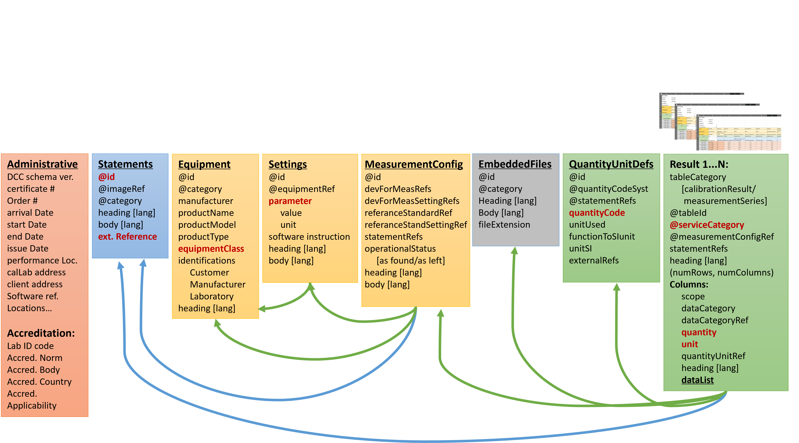
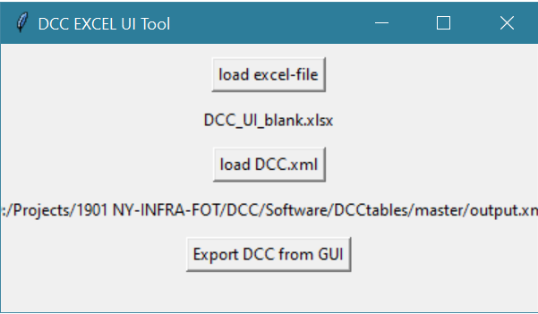
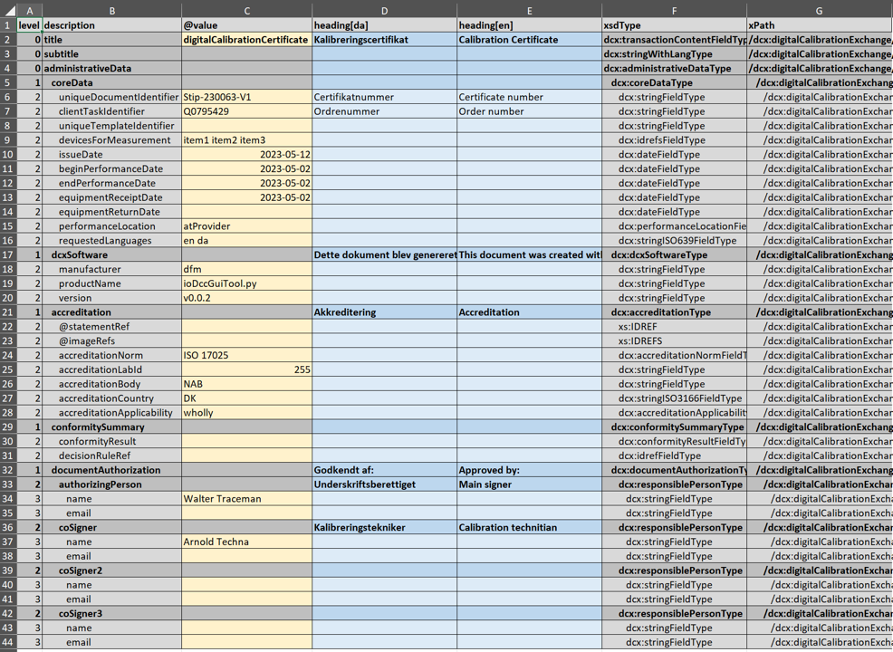
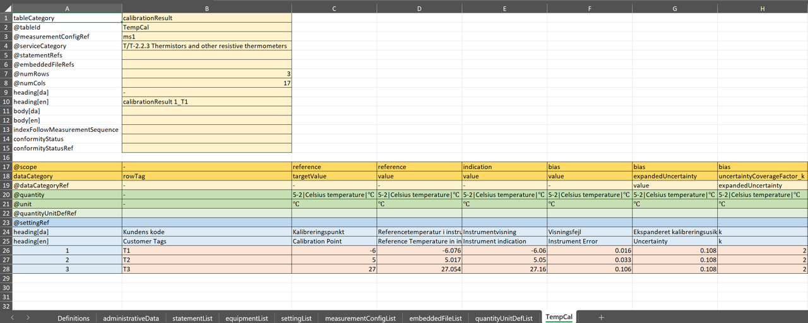
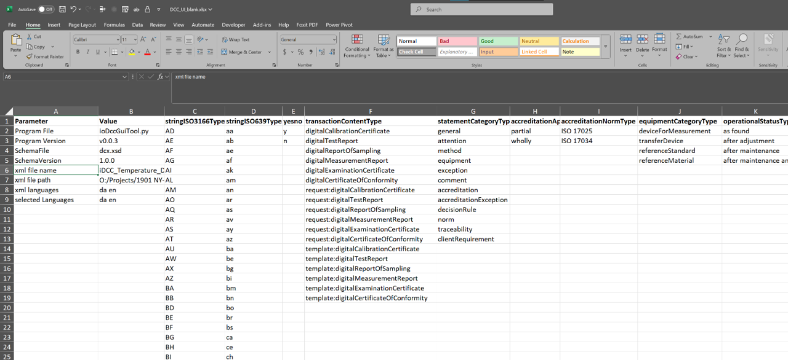
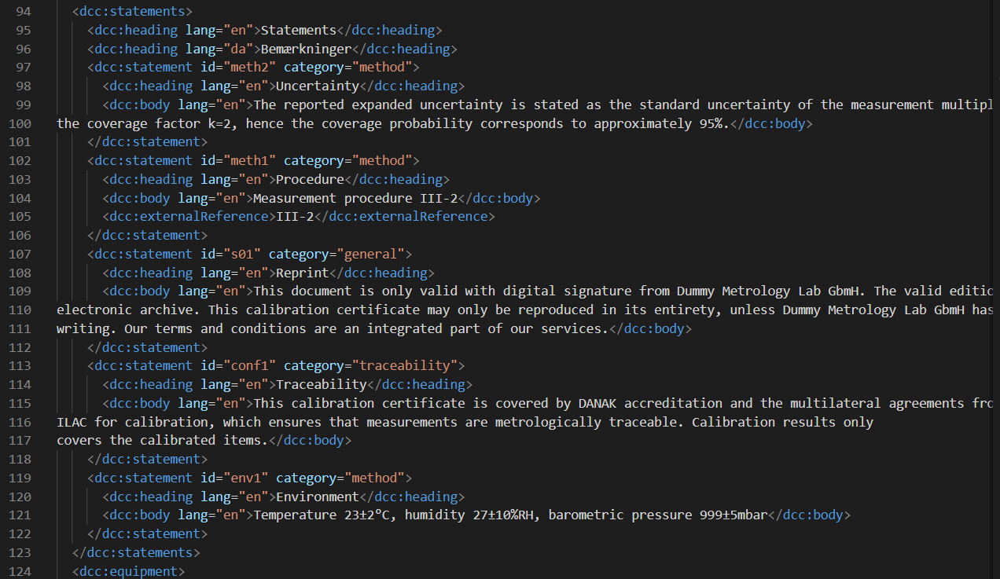

# DCC-Tables

This repository represents a solution for industrial oriented Digital Calibration Certificates (iDCC).  It has been developped in the atempt of generating a python based middleware for generating and loading digital calibration certificates with an Excel user-interface using the python package "xlwings". The provided middleware and xml-schema has been developed in parallel, which has been crucial to choices made for the xml-schema design, to facilitate flexibility for the DCC content while keeping middleware maintenance as low as possible. Being build around an excel user interface inherently makes it necessary to adapt to datastructures to the table-formats of the Excel sheets, which conveniently makes a good match to the typical datastructure used in relational SQL databases.  

The overall data structure of iDCC-xml's generated in this framework is represented in the diagram below.

To generate xml-dcc's that are in accordance with schema, an Excel sheet is used as interface in order to simplify the process of providing the input for the DCC. A base pipette example is provided in "SKH_10112_2.xml" and other examples are provided in the Examples folder. 

To run the gui interface run the following program: 

'> python ioDccGuiTool.py

# Primary files
* dcc.xsd : is the xml-Schema for the iDCC.  
* ioDccGuiTool.py : A demo UI tool loading, editing and generating DCC's, DCR's and templates. 
* dccQueryGui.py : A demo tool intented for clients when wanting to load specific data from receied DCC's. An base-examples is provided in the SKH_10112_2_Mapping.xlsx file. 

# Links
* [Screenshots](#Screenshots)
    - [Excel-userinterface](#pythonexcel-user-interface)
    - [xsd-schema](#schema-extracts)
    - [DCC xml example](#digital-calibration-certificate-xml-example)

# Examples 
* the Examples folder contains several Certificate examples for different measurement areas. 

# Screenshots

## Python/Excel user interface 
||

|----|----|
|||

### Excel Tabs for entering data

### AdministrativeData Tab

### Statements Tab [See xml](#statements-in-xml)

### Equipment Tab

### Settings Tab

### measuringSystems Tab

### embbededFiles Tab

### quantityUnitDefs Tab

### measurement Tabs

### Definitions Tabs
Keywords restricted by the xsd-schema is loaded into this tab, and used in the other tabs to restrict what can be entered, e.g. in the column-attributes.

# Schema Extracts
## Structure of AdministrativeDataType and coreDataType

## Column scope and dataCategory restrictions.

## SI unit value restriction 

## quantity value restrictions

# Digital Calibration Certificate XML example
## Administrative data in xml

## Statements in xml

## equipment, settings and measuringSystem in xml

## measurementResults in xml

## Envisaged Workflow 

# ToDo:
- [ ] make languages dynamic in the middleware, presently static to EN and DA.
- [ ] Provide more examples. 
- [ ] Improve schema and restrictions for DCC and DCR. 

contact info: Daid Balslev-Harder please write to (dbh @ dfm.dk) 