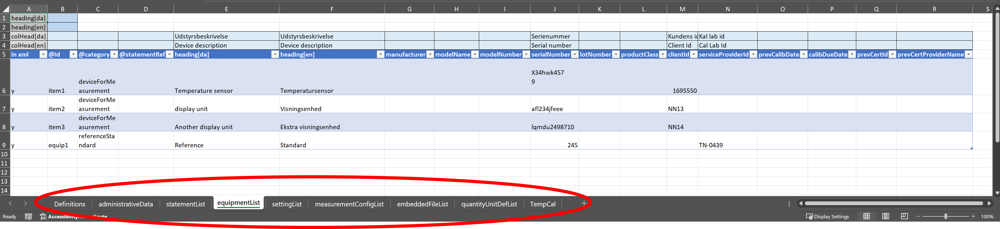
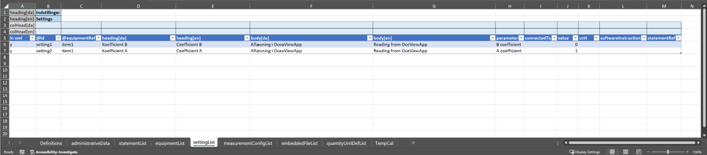
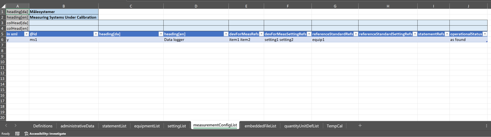
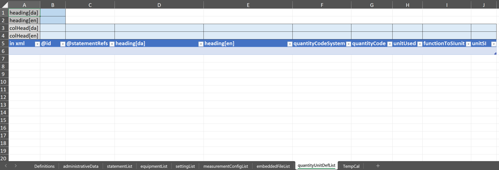
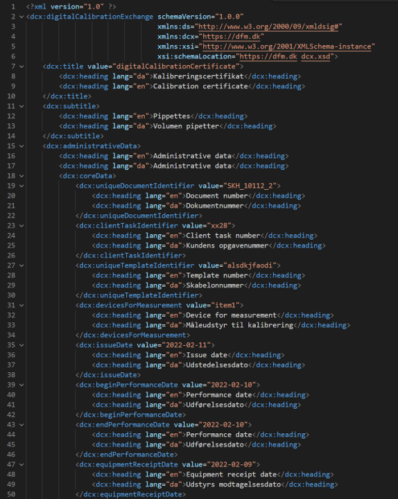

# DCC-Tables (DCX)

This repository represents a solution for industrial oriented Digital Calibration Exchange (DCX).  It has been developped in the atempt of generating a python based middleware for generating and loading digital calibration certificates (DCC's) with an Excel user-interface using the python package "xlwings". The provided middleware and xml-schema has been developed in parallel, which has been crucial to choices made for the xml-schema design, to facilitate flexibility for the DCC content while keeping middleware maintenance as low as possible. Being build around an excel user interface inherently makes it necessary to adapt to datastructures to the table-formats of the Excel sheets, which conveniently makes a good match to the typical datastructure used in relational SQL databases.  

The overall data structure of DCX-xml's generated in this framework is represented in the diagram below.

To generate xml-dcc's that are in accordance with schema, an Excel sheet is used as interface in order to simplify the process of providing the input for the DCC. A base pipette example is provided in "SKH_10112_2.xml" and other examples are provided in the Examples folder. 

To run the gui interface run the following program: 

'> python ioDccGuiTool.py

# Primary files
* dcx.xsd : is the xml-Schema for the DCX.  
* ioDccGuiTool.py : A demo UI tool loading, editing and generating DCC's, DCR's and templates. 
* dccQueryGui.py : A demo tool intented for clients when wanting to load specific data from receied DCC's. An base-examples is provided in the SKH_10112_2_Mapping.xlsx file. 

# Links
* [Screenshots](#Screenshots)
    - [Excel-userinterface](#pythonexcel-user-interface)
    - [xsd-schema](#schema-extracts)
    - [DCC xml example](#digital-calibration-certificate-xml-example)

# Quantity and Units model
## Default Qauntity system
The default quantity system is to use the definitions from ISO 80000 Series on Qauntity and Units. These  
qauntities are specified wihtin the dcc.xsd schema as shown in [XSD Sxhema quantity value restrictions](#xsd-schema-quantity-value-restrictions) and hence only these values can be selected by default. 

## Default units system 
The defaulet system for units is based the BIPM SI Digital Framework i.e. unit expressions allowed by the unit expression parser at [SI Digital Reference Point](https://si-digital-framework.org/SI/unitExpr]). The allowed expressions are enforced by a regular expression wihtin the dcc.xsd schema-file see [xsd unit value restriction](#xsd-schema-si-unit-value-restriction)

## Custom unit systems
If the default Quantity Unit system does not apply to a specific case, other quantity unit systems can be defined in the quantityUnitDefs element, see [XSD Schema for customizing quantities and units (quantityUnitDef)](#xsd-schema-elements-for-custom-quantity-unit).

# Examples 
* the Examples folder contains several Certificate examples for different measurement areas. 

# Querries using XPATH
examples of xpaths applicable in the dcc-example.xml: 

`*//*[@measurementConfigRef="ms2"][@tableId="calRes2"]/*[@scope="reference"][@quantity="3-4|volume|m3"][@unit="µL"]/dcc:value/*[@idx="2"]/text()` outputs 600.0417

`*//*[@measurementConfigRef="ms2"][@tableId="calRes2"]/*[@scope="indication"][@quantity="3-4|volume|m3"][@unit="µL"]/dcc:value/*[@idx="2"]/text()` outputs 600

`*//*[@measurementConfigRef="ms2"][@tableId="calRes2"]/*[@scope="bias"][@quantity="3-4|volume|m3"][@unit="µL"]/dcc:value/*[@idx="2"]/text()` ourputs 0.04

`*//*[@measurementConfigRef="ms2"][@tableId="calRes2"]/*[@scope="bias"][@dataCategoryRef="value"][@quantity="3-4|volume|m3"][@unit="µL"]/dcc:expandedUncertainty/*[@idx="2"]/text()` outputs 1.5

`*//*[@measurementConfigRef="ms2"][@tableId="calRes2"]/*[@scope="bias"][@dataCategoryRef="value"][@quantity="3-4|volume|m3"][@unit="%"]/dcc:expandedUncertainty/*[@idx="2"]/text()` outputs 0.25

## Xpath tool
http://xpather.com/ can be used to check xpaths. 

Notpad++ has the XPatherizerNPP plugin to execute xpath queries. 

In this repository the SKH_10112_2_mapping.xlsx provides a tool for building xpaths and when run with dccQueryGui.py the querry results will be added directly into the excel-file. 

# Screenshots

## Python/Excel user interface 
||

|----|----|
|||

### Excel Tabs for entering data

### AdministrativeData Tab

### Contacts and Locations

### Statements Tab [See xml](#statements-in-xml)

### Equipment Tab

### Settings Tab

### measuringSystems Tab

### embbededFiles Tab

### quantityUnitDefs Tab

### measurement Tabs

### Definitions Tabs
Keywords restricted by the xsd-schema is loaded into this tab, and used in the other tabs to restrict what can be entered, e.g. in the column-attributes.

# Schema Extracts
## XSD Schema Structure of AdministrativeDataType and coreDataType

## XSD Schema Column scope and dataCategory restrictions.

## XSD Schema SI unit value restriction 

## XSD Schema Quantity value restrictions

## XSD Schema Elements for Custom Quantity Unit

# Digital Calibration Certificate XML example
## Administrative data in xml

<!-- ## Statements in xml
 -->

<!-- ## equipment, settings and measuringSystem in xml
 -->

## measurementResults in xml

## Envisaged Workflow 

# ToDo:
- [ ] Extend documentation 

contact info: Daid Balslev-Harder please write to (dbh @ dfm.dk) 